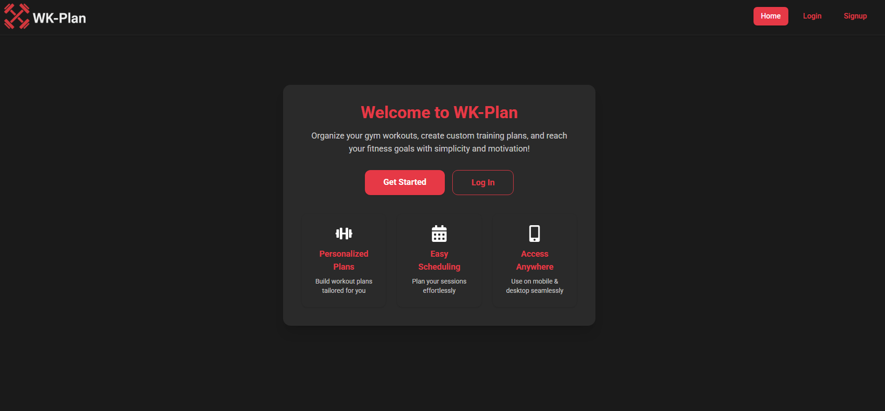
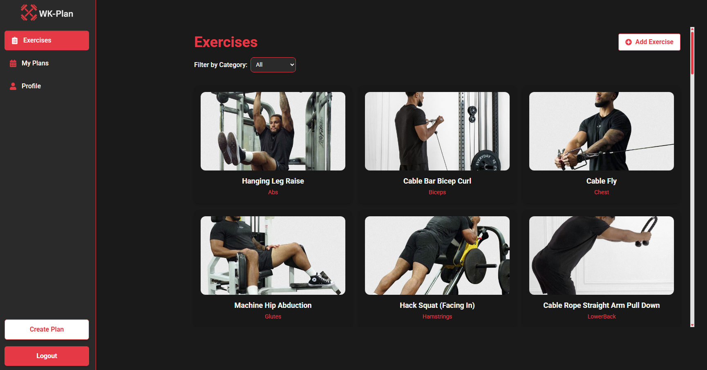
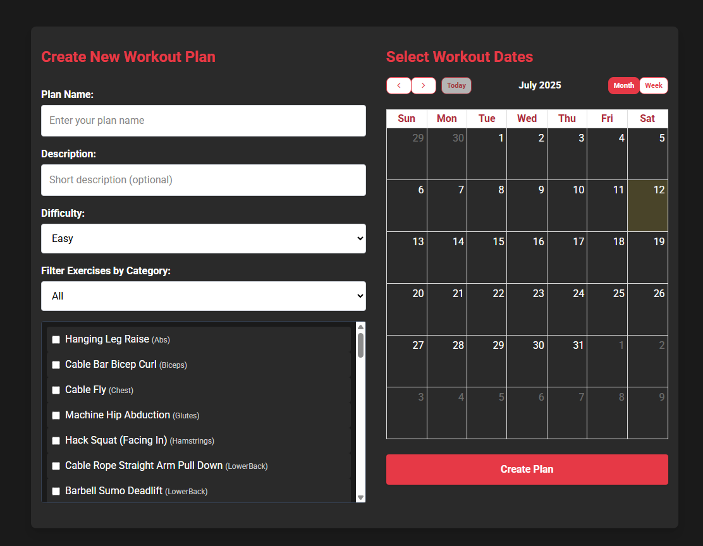

  

# WK-Plan

## Description
WK-Plan is a **full-stack workout planner** where users can create personalized workout plans, track exercises, and organize training dates easily, helping them stay motivated and consistent.

---

## User Stories

✅ 404: As an anon/user I can see a 404 page if I try to reach a page that does not exist so that I know it's my fault  
✅ Signup: As an anon I can sign up in the platform so that I can start creating my workout plans  
✅ Login: As a user I can login to the platform so that I can manage my workout plans  
✅ Logout: As a user I can logout from the platform so no one else can use it  
✅ Add Exercises: As a user I can add an exercise so that I can build my library for workout plans  
✅ List Exercises: As a user I can see exercises so that I can choose them for my workouts  
✅ Search/Filter Exercises: As a user I can filter exercises by category so I can find them easily  
✅ Create Workout Plans: As a user I can create workout plans so I can organize my training  
✅ See My Plans: As a user I can see and edit my workout plans so I can track my training progress  
✅ Change Password: As a user I can change my password to keep my account secure  
✅ Profile Page: As a user I can see my profile and recent plans for quick access

---

## Backlog

🚩 **User Profiles**: View other users' profiles and their workout plans.

🚩 **Calendar Sync**: Sync workout plans with Google Calendar.

---

## Client

### Routes

- `/` - Homepage
- `/signup` - Signup form
- `/login` - Login form
- `/dashboard/exercises` - Exercises list
- `/dashboard/add-exercise` - Create an exercise
- `/dashboard/exercises/:slug` - Exercise detail
- `/dashboard/edit-exercise/:id` - Edit an exercise
- `/dashboard/delete-exercise/:id` - Delete an exercise
- `/dashboard/create-plan` - Create a workout plan
- `/dashboard/my-plans` - My workout plans
- `/dashboard/my-plans/:id` - Plan detail page
- `/dashboard/delete-plan/:planId` - Delete Plan page
- `/dashboard/edit-plan/:planId` - Edit Plan page
- `/dashboard/profile` - My profile page
- `/dashboard/change-password` - Change password
- `*` - 404 Page

### Pages

- Home Page (public)
- Sign up Page (anon only)
- Log in Page (anon only)
- Exercises List Page (user only)
- Exercise Create Page (user only)
- Exercise Detail Page (user only)
- Exercise Edit/Delete Pages (user only)
- Create Plan Page (user only)
- My Plans Page (user only)
- Plan Detail Page (user only)
- Profile Page (user only)
- Change Password Page (user only)
- 404 Page (public)

### Components

- **Exercise Card component**: Displays exercise data with navigation to detail/edit/delete.
- **Calendar component**: Select dates for workout plans.
- **Search/Filter component**: Filter exercises by category.
- **Navbar and Sidebar components** for navigation.

---

## IO Services

### Auth Service

- `auth.login(user)`
- `auth.signup(user)`
- `auth.logout()`
- `auth.me()`
- `auth.getUser()` 

### Exercise Service

- `exercise.list()`
- `exercise.create(data)`
- `exercise.detail(id)`
- `exercise.update(id, data)`
- `exercise.delete(id)`

### Workout Plan Service

- `plan.list()`
- `plan.create(data)`
- `plan.detail(id)`
- `plan.update(id, data)`
- `plan.delete(id)`

---

## Server

### Models

**User model**
- `name`: String (required)
- `email`: String (required & unique)
- `password`: String (required)
- `role`: String (default: user)

**Exercise model**
- `name`: String (required)
- `category`: String (required)
- `guide`: String
- `mediaUrl`: String

**Workout Plan model**
- `title`: String (required)
- `description`: String
- `difficulty`: String (easy, medium, hard)
- `exercises`: [ObjectID<Exercise>]
- `user`: ObjectID<User> (required)
- `dates`: [String]

---

## API Endpoints / Backend Routes

- `POST /auth/signup` - body: `name`, `email`, `password`
- `POST /auth/login` - body: `email`, `password`
- `GET /auth/me` - header: `Authorization`
- `PUT /auth/change-password` - body: `currentPassword`, `newPassword`
- `GET /exercises`
- `POST /exercises`
- `GET /exercises/:id`
- `PUT /exercises/:id`
- `DELETE /exercises/:id`
- `GET /workout-plans`
- `POST /workout-plans`
- `GET /workout-plans/:id`
- `PUT /workout-plans/:id`
- `DELETE /workout-plans/:id`

---

## 🔗 Links

- **Client Repository:** [WK-Plan Frontend](https://github.com/fabiormiranda/WK-Plan)
- **Server Repository:** [WK-Plan Backend](https://github.com/fabiormiranda/WK-Plan-Backend)
- **Frontend Live:** [WK-Plan on Netlify](https://wk-plan.netlify.app/)
- **Backend Live:** [WK-Plan Backend on Render](https://wk-plan-backend.onrender.com)

## Screenshots

### Homepage

### Exercises Dashboard

### Create Plan Page

